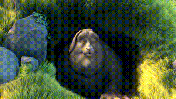
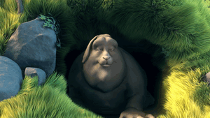

# gifgen

> Simple high quality GIF encoding

If you've ever tried encoding GIFs with `ffmpeg` there's a good chance your results came out looking pretty bad. This is because GIFs are limited to a palette of 256 colours and `ffmpeg` just uses a generic palette to be able to cover a wide range of colours.

`gifgen` produces much better results by doing a 2-pass encode. The first pass generates a custom colour palette based on all of the pixels from each frame. The second pass encodes the GIF using this palette instead of the default one bundled with `ffmpeg`.

**ffmpeg default:**



**gifgen:**



## Usage

```
$ gifgen -h
gifgen 1.1.3

Usage: gifgen [options] [input]

Options:
  -o   Output file [input.gif]
  -f   Frames per second [10]
  -s   Optimize for static background
  -v   Display verbose output from ffmpeg
  -w   Scale output with horizontal resolution
  -c   Cut and discard the beginning of the input video (in seconds)
  -d   Duration in seconds of the resulting gif, can be combined with cut

Examples:
  $ gifgen video.mp4
  $ gifgen -o demo.gif SCM_1457.mp4
  $ gifgen -sf 15 screencap.mov
  $ gifgen -sf 15 -w 320 screencap.mov

Cut the first 3.5 seconds, make the gif using the next 5.5 seconds
  $ gifgen -c 3.5 -d 5.5 screencap.mov
```

## Installation

### macOS

```shell
brew install lukechilds/tap/gifgen
```

### Linux

Just clone this repo and either copy/symlink `gifgen` to your PATH or run the script directly with `./gifgen`. Requires `ffmpeg` to be installed.

### Windows

```
¯\_(ツ)_/¯
```

## Credits

`gifgen` is pretty much just the information from [this blog article](http://blog.pkh.me/p/21-high-quality-gif-with-ffmpeg.html) wrapped up in a shell script. Full credit goes to the original [author](http://ubitux.fr/).

## License

MIT © Luke Childs
